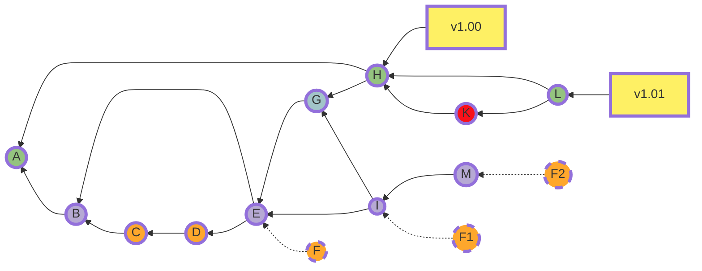

# Guide

Download and run
-------------
The folder "_RTNS 2016 - Artifact paper 75_" contains two sub-folders one for each experiment presented in the [paper](https://github.com/SlimBenAmor/depndentProbTask-RTNS2016/blob/master/rtns2016.pdf). To download the folder simply click on the green button marked "Clone or download" then on Download ZIP. You may then extract all the files from the archive.

The first folder named "*Experiment_1*" contains the necessary files to reproduce the results presented in Table 3. The second folder named "*Experiment_2*" will reproduce the results of Figure 4. The code can be executed in Matlab (or equivalent e.g. Octave, Scilab). In order to run a certain experiment, set the "current folder" of Matlab on the folder of that experiment and execute the "*Main_ExperimentX*" script.

Changing initial parameters 
-------------
The provided scripts are set to perform the experiments presented in the [paper](https://github.com/SlimBenAmor/depndentProbTask-RTNS2016/blob/master/rtns2016.pdf), in order to reproduce their results. 
Further experiments can be created by changing the input parameters in the "*Main_ExperimentX*" scripts.
These parameters are: 
- number of tasks, denoted by "_NumberOfTasks_".
- number of values per distribution, denoted by "_NumberOfValues_".
- system utilization, denoted by "_Utilization_".

**Note on changing the number of tasks in the system:** _For Experiment 1, the number of tasks in the system is set
, and so is the precedence matrix "G" which describes the precedence constraints between tasks.
If the number of tasks is changed then the precedence matrix "G" needs to be changed as well, otherwise the experiment will result in errors. 
The precedence matrix "G" for experiment 2 is randomly generated according to the number of tasks, so in this case the number of tasks can be changed._

Hardware and experiment duration 
-------------------------------
In our work, we used a windows machine with an Intel i7 processor, 8Gb RAM and Matlab 2014a to perform the two experiments. In this setting
it took about 10 minutes to perform the first experiment and about 50 minutes to perform the second one.
For a simplified version of these experiments (with smaller run time), the number of analysed Task-sets can be decreased. The default is 10 sets in the first Experiment and 100 sets for the second. These numbers can be decreased all the way down to 1 for faster experiment notation, but they can also be increased to an arbitrary number for a longer experiment.  

Results interpretation
-------------------------------

- **First experiment:** The output of the script "Main_Experiment1"  is a vector representing the 
schedulability ratio of the analysed Task-sets . If this ratio is less than 
100% then the Task-set is not schedulable by the deterministic test illustrated by 
Equation 3 in the [paper](https://github.com/SlimBenAmor/depndentProbTask-RTNS2016/blob/master/rtns2016.pdf). The resulting vector corresponds to the third column of 
Table 3 in the [paper](https://github.com/SlimBenAmor/depndentProbTask-RTNS2016/blob/master/rtns2016.pdf). Each value of this vector represents the schedulability ratio of a Task-set.

- **Second experiment:** For the script "Main_Experiment2", the output is a bar graph similar to 
Figure 4 in the [paper](https://github.com/SlimBenAmor/depndentProbTask-RTNS2016/blob/master/rtns2016.pdf). This figure represents the number of Task-sets schedulable with a given 
ratio grouped in 10% intervals. We note that there is a considerable proportion of Task-sets that are schedulable with a ratio of only 0% to 10%. This may be explained 
by the fact that the randomly generate precedence relations imposed on the tasks are too stringent and difficult to realize, making the Task-set non-schedulable.
Similarly, the high proportion of task-sets schedulable with a ratio of 90% or higher can be explained by the fact that the precedence constraints are not too stringent, giving the Task-set a high chance of being feasible. 

